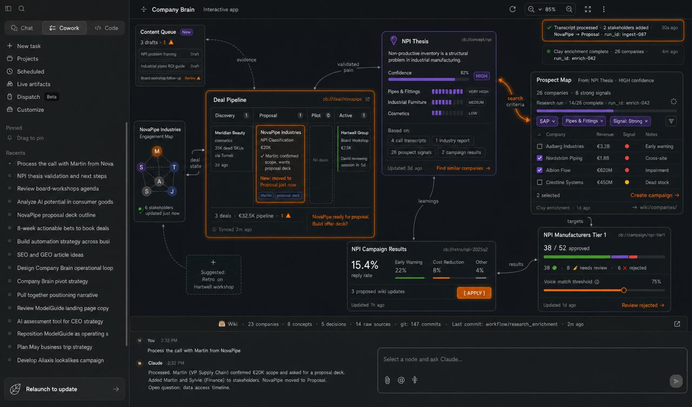

# Company Brain



An infinite canvas for go-to-market operations that lives inside Claude as an MCP App. Deals, hypotheses, prospects, campaigns, and results are interactive nodes on a spatial canvas. Claude is the orchestrator — user actions on the canvas fire events back to Claude, which does the work and updates the canvas.

## How it works

Three interaction channels:

- **Silent** — pan, zoom, drag nodes. Changes what's in focus, doesn't bother Claude.
- **Canvas feedback** — clicking action buttons or sending messages from a node fires a `sendFollowUpMessage` to Claude with the full node context. Claude decides what to do and calls MCP tools to update the canvas.
- **Explicit** — typing in the chat (Claude Code, Claude Web, or the mcp-use inspector). Claude calls canvas tools directly.

The loop: **Claude calls MCP tools -> canvas state mutates -> canvas re-renders -> user interacts -> event fires -> Claude gets notified -> Claude acts again.**

## Architecture

```
Claude (Code / Web / ChatGPT)
    |  MCP protocol (HTTP SSE)
    v
MCP Server (mcp-use, port 3011)
    |  14 tools, 1 inline widget
    |  canvas state in-memory + persisted to disk
    |  SSE broadcast on port 3002
    v
Canvas Widget (React Flow, inline in conversation)
    + Standalone Web App (Next.js, port 3000)
```

Single protocol surface. No REST APIs, no separate event bus. Adding a new capability = adding a new MCP tool.

## MCP Tools

| Tool | What it does |
|------|-------------|
| `add_node` | Create a node (generic, note, task, wiki, brief, engagement, hypothesis, prospect, campaign, retro) |
| `update_node` | Update label, content, status |
| `remove_node` | Remove node + cascading edges |
| `add_edge` / `remove_edge` | Connect or disconnect nodes |
| `move_node` | Reposition a node |
| `clear_canvas` | Wipe everything |
| `get_canvas_state` | Full JSON snapshot |
| `search_knowledge` | Search nodes by keyword |
| `ingest_knowledge` | Accept raw content (transcript, email, policy), create ingestion node, instruct Claude to extract entities |
| `create_agent_task` | Create a task node; Claude executes the instructions using canvas tools |
| `show_company_brain` | Load the Company Brain dashboard with prefilled sample data |
| `company_brain_chat` | Regenerate dashboard based on a user message |
| `show_canvas` | Render the interactive canvas inline as a widget |

## Quick start

```bash
# Install
npm install --legacy-peer-deps

# Run (kills stale ports, starts web + MCP server)
npm run dev
```

This starts:
- **Web app** at `http://localhost:3000` (standalone canvas with SSE sync)
- **MCP server** at `http://localhost:3011` (tools + inline widget)
- **Inspector** at `http://localhost:3011/inspector` (test tools directly)

## Connect to Claude

**Claude Web** — click "Start Tunnel" in the inspector to get a public URL, then add it as a connector at [claude.ai/settings/connectors](https://claude.ai/settings/connectors).

**Claude Code** — add to `.claude/settings.json`:
```json
{
  "mcpServers": {
    "canvas": {
      "url": "http://localhost:3011/sse"
    }
  }
}
```

**Inspector Chat** — go to `http://localhost:3011/inspector`, click the Chat tab, type "show me the company brain".

## Company Brain knowledge files

Sample GTM data lives under `company-brain/`:

```
company-brain/
  CLAUDE.md              # Instructions for Claude on how to use the wiki
  index.md               # Directory of all wiki pages
  wiki/
    entities/            # Companies, people, prospects
    concepts/            # NPI thesis, email architecture
    decisions/           # Strategic decisions with rationale
    pipeline/            # Active deals, campaign state
    workflows/           # Outreach playbooks
  raw/
    transcripts/         # Call transcripts
    emails/              # Sent emails
    research-inputs/     # External research
```

## Stack

- **mcp-use** — MCP server framework with inline widget support
- **React Flow** (@xyflow/react) — infinite canvas
- **Next.js** — standalone web app
- **Tailwind CSS** — styling
- **AG-UI event format** — SSE state snapshots between MCP server and web app

## License

MIT
